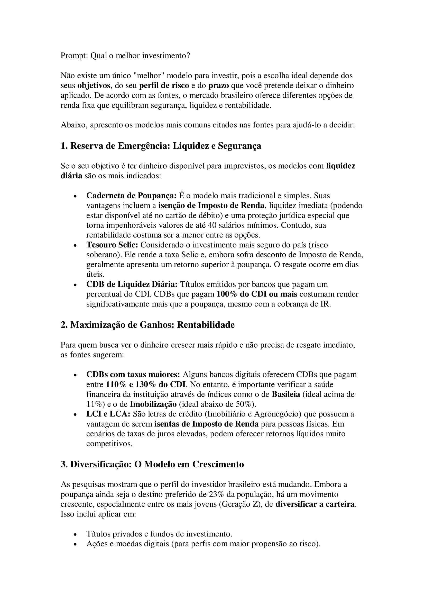

# NotebookLM

### Desenvolvimento de um caderno temático introdutório à educação financeira

Este desafio consiste em criar no NotebookLM um caderno temático de algum assunto financeiro. O tema escolhido foi a caderneta de poupança. Os textos analisam a caderneta de poupança como o investimento mais tradicional do Brasil, destacando sua simplicidade, isenção fiscal e alta liquidez. Apesar de sua popularidade, as fontes apontam uma baixa rentabilidade em comparação a alternativas de renda fixa, como o Tesouro Selic e os CDBs, que frequentemente oferecem retornos superiores. A segurança é um ponto central, mencionando o suporte do Fundo Garantidor de Crédito (FGC) e proteções judiciais específicas para depósitos em poupança. Pesquisas recentes indicam uma mudança comportamental, especialmente entre os jovens, que estão migrando para opções mais rentáveis e diversificadas. O conteúdo serve como um guia para comparar ganhos reais, explicando como as variações da taxa Selic impactam diretamente o rendimento dessas aplicações. No geral, as fontes questionam se a conveniência da poupança ainda justifica seu uso frente a novos produtos financeiros mais eficientes.

### O que é NotebookLM?

NotebookLM é uma ferramenta de inteligência artificial criada pelo Google Labs (parte da família de produtos Google com IA) que funciona como um assistente de pesquisa e anotação inteligente, permitindo que você interaja com seus próprios documentos e materiais de estudo de forma conversacional.

- Principais recursos

    - Resumos e explicações — transforma material complexo em respostas ou resumos mais simples.

    - Conversas com seus documentos — você pode fazer perguntas como se estivesse dialogando com seu conteúdo.

    - Visões gerais em áudio — converte informações em áudio estilo podcast para ouvir em vez de ler.

    - Suporte a múltiplos tipos de arquivo — PDFs, Docs, apresentações, URLs e mais.

    - Citações de fontes — identifica de onde cada resposta foi retirada no material que você carregou.

---

### Apresentação de conteudo gerado por NotebookLM: [Poupança_O_Fim_de_um_Reinado.pdf](Poupança_O_Fim_de_um_Reinado.pdf)

### Teste de Prompt: [Prompt](Prompt.pdf)

### Mapa mental:

### Video gerado pelo conteúdo armazenado em NotebookLM: [Poupança Ainda Vale a Pena](Poupança__Ainda_Vale_a_Pena_.mp4)

